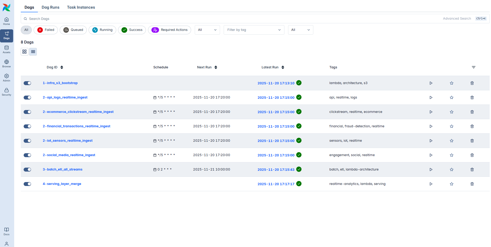

# 📡 Lambda Architecture Data Pipeline (Real-Time + Batch)

**Production-Grade Data Platform with Apache Airflow & AWS S3**


**A complete, end-to-end Lambda Architecture implementation that combines lightning-fast real-time processing with reliable daily batch jobs — fully orchestrated, monitored, and production-pattern ready.**



Perfect portfolio piece for Senior/Lead Data Engineer roles — shows deep understanding of modern data architectures, orchestration at scale, medallion architecture, incremental processing, and cloud-native storage design.

Live demo available on request (Airflow UI + sample dashboards).

---

## 🚀 Why This Project Stands Out (Recruiter-Friendly Highlights)

- Full **Lambda Architecture** implemented from scratch (Speed + Batch + Serving layers)
- Real-world scheduling: **real-time every 5 min**, **batch daily at 2 AM**, **serving merge every 10 min**
- **Medallion architecture** (Bronze → Silver → Gold) inside the batch layer
- Five realistic data streams simulated (IoT, clickstream, logs, social, financial)
- Clean, modular, reusable Airflow DAGs with custom utilities and best practices
- 100% cloud-native storage design on S3 with intelligent partitioning
- Easily extensible to Spark, dbt, Snowflake, Athena, Glue, Redshift, etc.

**This is not a toy ETL script — it's a miniature but fully functional modern data platform.**

---

## 🏆 Demo Screenshot (Airflow DAGs Running)

  
_(Replace with your actual screenshot — highly recommended! Shows successful runs, task dependencies, and timing)_

---

## 🏗 Architecture Diagram (Mermaid — renders beautifully on GitHub)

```text
                    ┌──────────────────────────────┐
                   │          Speed Layer          │
                   │       (Real-Time Ingest)      │
                   │  Interval: Every 5 minutes    │
                   └───────────────┬───────────────┘
                                   │
                                   ▼
                   ┌──────────────────────────────┐
                   │          Batch Layer          │
                   │      Daily ETL at 2:00 AM     │
                   └───────────────┬───────────────┘
                                   │
                                   ▼
                   ┌──────────────────────────────┐
                   │          Serving Layer       │
                   │     Merge Batch + Real-Time  │
                   │   Interval: Every 10 minutes │
                   │   Interval: Every 10 minutes │
                   └──────────────────────────────┘
```

## ⚙️ Airflow DAGs Overview

| DAG ID                         | Schedule        | Layer   | Purpose                               | Key Features                    |
| ------------------------------ | --------------- | ------- | ------------------------------------- | ------------------------------- |
| 1-infra_s3_bootstrap           | @once / Manual  | Infra   | Create buckets + folders              | Idempotent, safe to rerun       |
| 2-\*\_realtime_ingest (5 DAGs) | every 5 minutes | Speed   | Ingest raw events → S3 realtime/      | Partitioned by date/hour        |
| 3-batch_etl_all_streams        | everyday in 2AM | Batch   | Bronze → Silver → Gold (full history) | Incremental + watermark support |
| 4-serving_layer_merge          | 0 0 \* \* \*    | Serving | Merge latest realtime + full batch    | Produces dashboard-ready tables |

All DAGs include retries, SLA alerts, detailed logging, and task-level documentation.

## 📁 Project Structure (Clean & Professional)

```text
airflow/
├── dags/
│ ├── **init**.py
│ ├── create_s3_buckets.py
│ ├── realtime/
│ │ ├── **init**.py
│ │ └── \*.py (5 modular realtime DAGs)
│ ├── batch_etl.py
│ └── serving_layer.py
├── plugins/
│ └── utils/
│ └── s3_utils.py # Reusable functions with boto3 session handling
├── docker-compose.yaml # Optional: Astro Runtime ready
├── requirements.txt
└── README.md

```

## 🔄 Data Flow & S3 Layout (Production-Ready Partitioning)

```text
s3://your-data-lake-bucket/
├── realtime/
│ └── {stream}/year=2025/month=11/day=20/hour=14/data_1415.json
├── batch/
│ ├── bronze/{stream}/dt=2025-11-19/
│ ├── silver/{stream}/dt=2025-11-19/
│ └── gold/{stream}/dt=2025-11-19/
└── serving/
├── unified/{stream}/dt=2025-11-20/ # latest complete view
├── dashboards/{stream}\_daily_metrics.parquet
├── analytics/{stream}\_features.parquet
└── alerts/high_value_transactions_20251120.json
```

## 🔥 What I Learned & Why Companies Love This Pattern

- Mastering complex orchestration with dependencies across layers
- Designing for exactly-once semantics in real-time pipelines
- Balancing latency vs accuracy trade-offs
- Writing production-grade, testable, and documented data code
- Thinking like a data platform team at scale (Netflix, Uber, Airbnb all use variants of Lambda)

## 📈 Future Enhancements (Shows Forward Thinking)

- Add Spark/Databricks for large-scale processing
- Integrate dbt for Gold layer transformations
- Add QuickSight/Looker dashboards on top of serving layer
- Deploy to MWAA (Managed Workflows for Apache Airflow)
- Add monitoring with Prometheus + Grafana

Made with ❤️ by Franz Monzales — Future Data Engineer
🔗 [linkedin.com/in/franz-monzales-671775135](https://www.linkedin.com/in/franz-monzales-671775135) | ✉️ ikigamidevs@example.com
